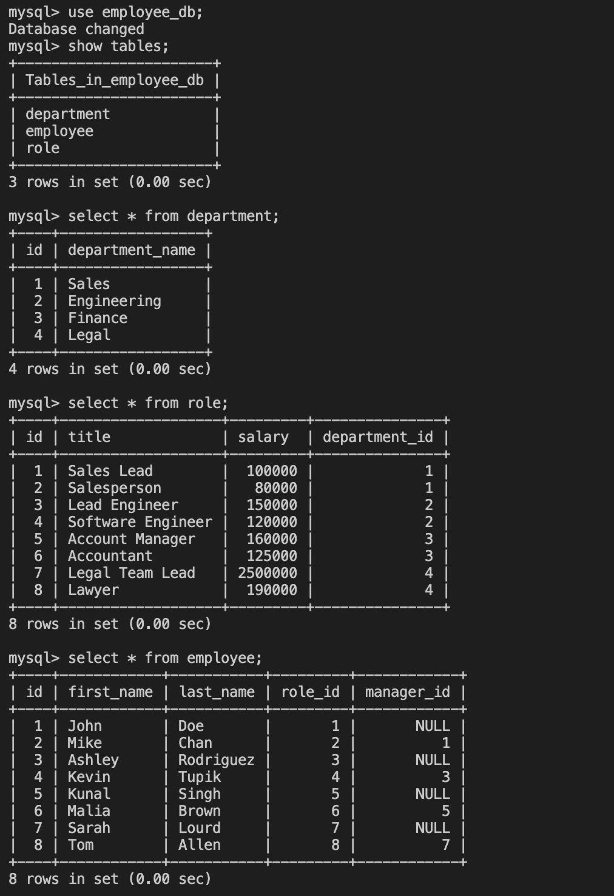

# Employee-Tracker-MySQL

## Description
This is a command-line application to manage a company's employee database, using Node.js, Inquirer, and MySQL. This application will allow users to view, add, and edit employees, roles, departments, and managers

## Websites
- Click to view walk through video: [Screencastify](https://app.castify.com/watch/5601ca36-a744-495e-92fc-36d5c78dc6b9)
- GitHub Repo; https://github.com/Zoujiejie/Employee-Tracker-MySQL 

## Usage & Installation
- Run ```npm install``` to download all the dependencies (inquirer, express, mysql2, console.table, dotenv)
- Open mysql in the integrated terminal, run ```mysql -u root -p``` to start mysql, run ```source db/schema.sql``` and ```source db/seeds.sql``` to retrieve data from the employee_db database
- Open server.js in the intergated terminal and run ```node server.js``` to start the prompts

## User Story
```sh
AS A business owner
I WANT to be able to view and manage the departments, roles, and employees in my company
SO THAT I can organize and plan my business
```

## Acceptance Criteria
```sh
GIVEN a command-line application that accepts user input
WHEN I start the application
THEN I am presented with the following options: view all departments, view all roles, view all employees, add a department, add a role, add an employee, and update an employee role
WHEN I choose to view all departments
THEN I am presented with a formatted table showing department names and department ids
WHEN I choose to view all roles
THEN I am presented with the job title, role id, the department that role belongs to, and the salary for that role
WHEN I choose to view all employees
THEN I am presented with a formatted table showing employee data, including employee ids, first names, last names, job titles, departments, salaries, and managers that the employees report to
WHEN I choose to add a department
THEN I am prompted to enter the name of the department and that department is added to the database
WHEN I choose to add a role
THEN I am prompted to enter the name, salary, and department for the role and that role is added to the database
WHEN I choose to add an employee
THEN I am prompted to enter the employee’s first name, last name, role, and manager, and that employee is added to the database
WHEN I choose to update an employee role
THEN I am prompted to select an employee to update and their new role and this information is updated in the database
```

## Screenshot
This is a screenshot of tables in mysql.
